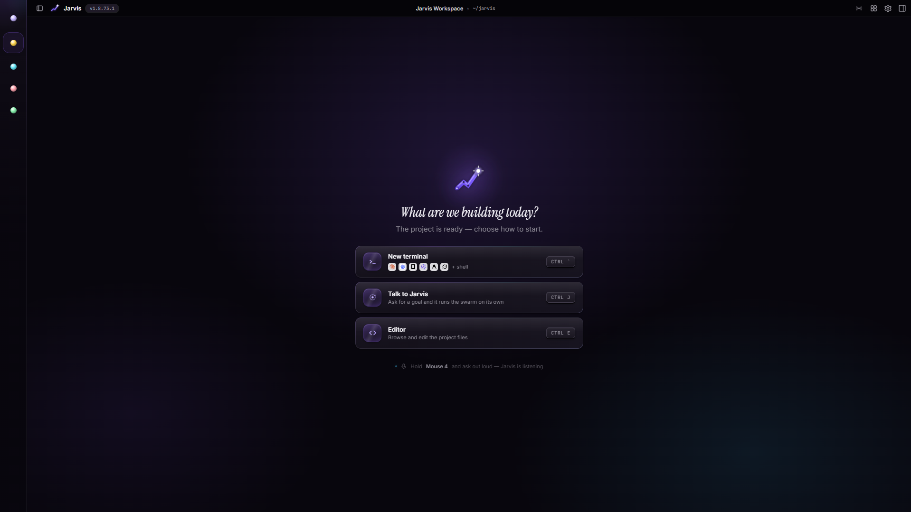
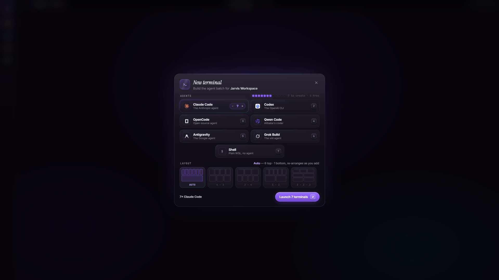
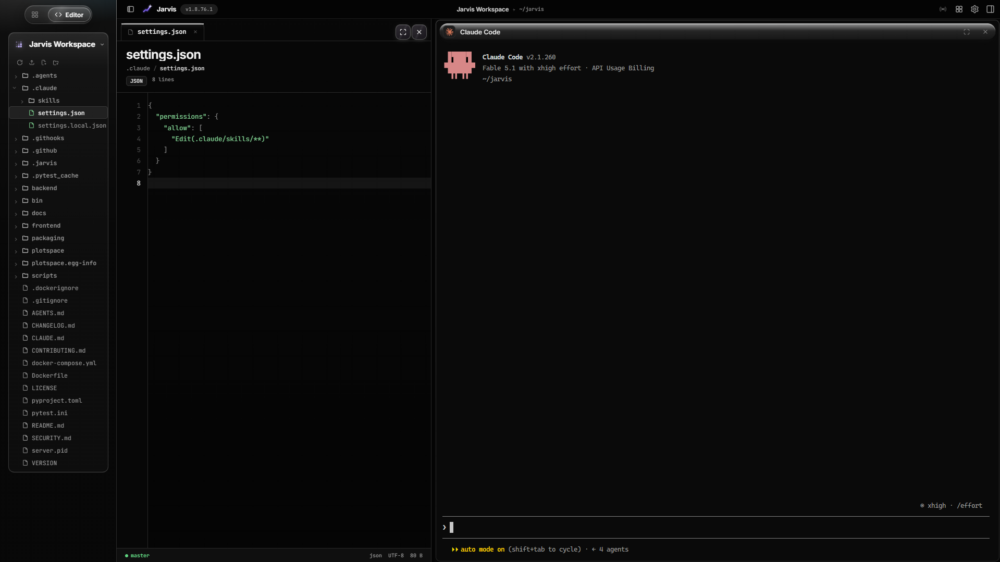
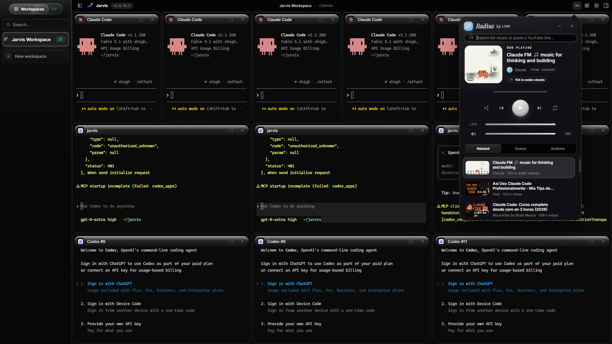
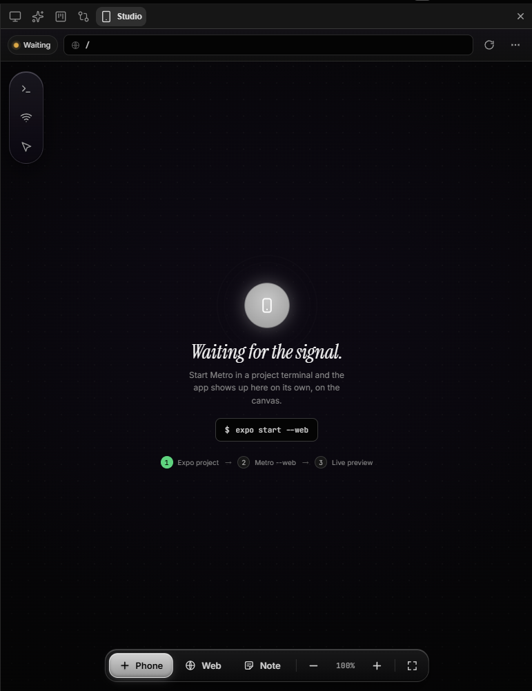
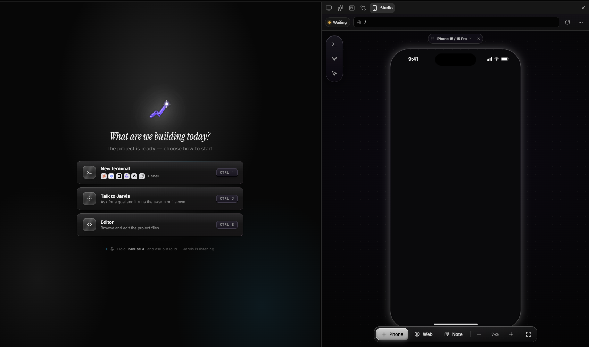
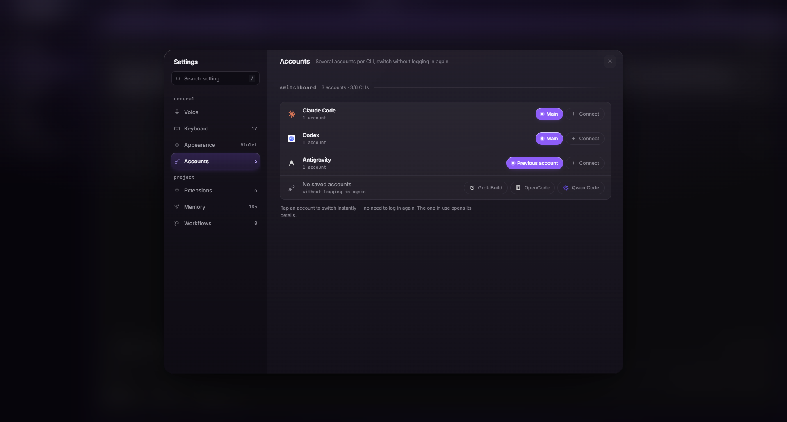
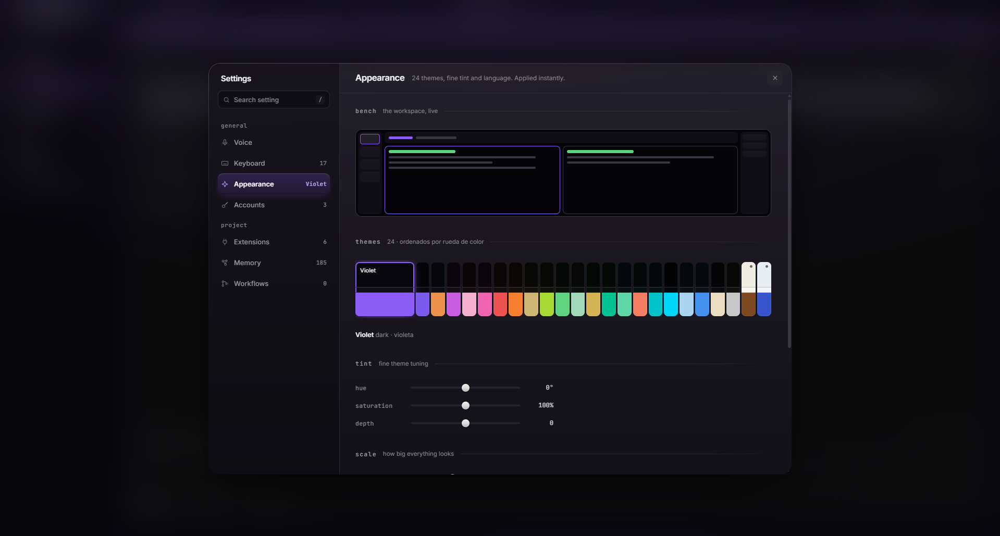

<div align="center">

# Jarvis Workspace

A local web cockpit that runs several AI coding agents side by side — your keys, your machine.

[](LICENSE)


**[Install · Linux / macOS](#linux--macos)** &nbsp;·&nbsp; **[Install · Windows](#windows)**

</div>

You open a project. Jarvis gives you a grid of live terminals. Claude Code, Codex, OpenCode, Qwen, Antigravity, Grok Build, or a shell — each in its own pane, all on the same branch. You bring the accounts. Jarvis only orchestrates.

<table>
<tr>
<td width="50%" valign="top">

<h2 id="linux--macos">Linux / macOS</h2>

```bash
curl -fsSL https://raw.githubusercontent.com/stiifff/jarvis-workspace/main/install.sh | bash
```

Then `jarvis`. Opens `http://localhost:3000`. macOS needs [Homebrew](https://brew.sh). Details: [Linux](docs/install/linux.md) · [macOS](docs/install/macos.md).

</td>
<td width="50%" valign="top">

<h2 id="windows">Windows</h2>

```powershell
irm https://raw.githubusercontent.com/stiifff/jarvis-workspace/main/install.ps1 | iex
```

Engine runs in [WSL2](docs/install/windows.md). One reboot if WSL is new. Leaves **Jarvis.bat** on the Desktop. Details: [Windows](docs/install/windows.md).

</td>
</tr>
</table>

Full app (terminals, voice, preview, Mobile Studio, …). Link your own CLIs in ⚙ → Accounts. Docker: `cp .env.example .env && docker compose up -d --build` (large, experimental).

---

### Start here

The empty workspace. One project, nothing running yet. New terminal, talk to Jarvis, or open the editor.

<p align="center">
  
</p>

### Launch a swarm

Pick agents, how many, and a layout. Seven Claude Codes, a mix, or one shell. They land in a live grid.

<p align="center">
  
</p>

<p align="center">
  
</p>

### Editor and radio by your side

Edit your project while the agent works in its own pane — file tree and a live terminal together. Or open the Radio: search YouTube music or play a curated station while the swarm builds.

<p align="center">
  
</p>

<p align="center">
  
</p>

### Mobile Studio

Preview your app in a live phone frame — add phone frames, web browsers or project notes to the canvas, zoom to taste. Phones connect to the Expo/Metro the agent started: the empty canvas explains the three steps — start the project, run Metro, the app lands on the frame. Mobile Studio also **detects Expo projects** — when the agent starts Metro, the mobile tab opens on its own (⚙ → Appearance → auto-start).

<p align="center">
  
</p>

<p align="center">
  
</p>

### Memory, as a neuron graph

The shared memory of the swarm, as living neurons — each memory is a node (size = connections), the memory itself pulses at the core. Zoom, pan, hover any neuron to see its title and links, or watch the synapses fire.

<p align="center">
  
</p>

### Live on Discord

Windows only: the launcher (`Jarvis.exe`) pushes your fleet to Discord — live activity, agent count and uptime while the swarm works.

<p align="center">
  
</p>

### Your accounts, not ours

⚙ → **Accounts**. Several logins per CLI, switch without logging in again. Native sessions (Grok, Claude, …) show up even if you never clicked Connect. Rate-limit? It rotates.

<p align="center">
  
</p>

### Make it yours

⚙ → **Appearance**. 24 themes, tint, language, scale. The bench at the top is the live workspace.

<p align="center">
  
</p>

Also in the dock: web preview, editor, tasks, per-agent diff review. Hold your voice key to dictate (Groq’s free Whisper API).

## Use

| | |
|---|---|
| **Ctrl+T** | New project |
| **Ctrl+\\** | New terminals |
| **⚙** | Accounts, appearance, voice |
| **Ctrl+P** | Dock |

Also: `Ctrl+B` strip · `Ctrl+E` editor · `Ctrl+J` Jarvis chat · `Ctrl+1…9` jump to a project. Port **3000** is Jarvis — put dev servers on 5000–5999 or 8081–8999.

## Tests

```bash
source venv/bin/activate
python -m pytest
node frontend/sections/**/__tests__/*.test.js
```

Vanilla HTML/CSS/JS, no npm. PRs: [`CONTRIBUTING.md`](CONTRIBUTING.md). Keep secrets out of git (`data/`, `.env`).

## License

[MIT](LICENSE) © 2026 Jarvis Workspace contributors
